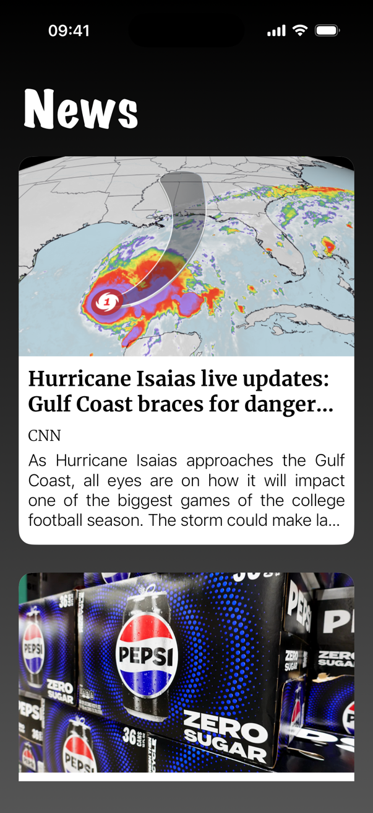
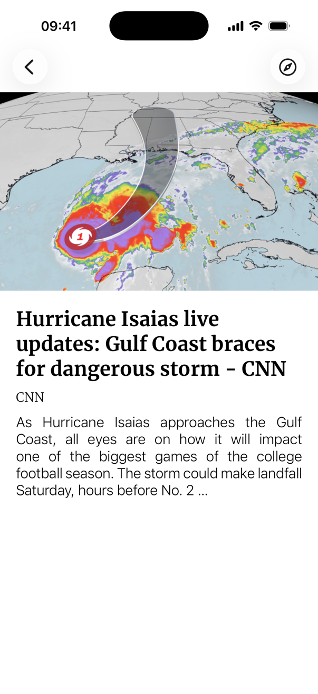

# News-App

The app - is the list of the top news of the USA:

User can scroll down through the current top news. Also, user can pull to refresh to update timeline.
When the news is tapped, a new application window with details opens: 

The API gives only the beginning of an article, so the details window has a button that opens the full text in Safari.

## Requirements

- Xcode 26
- iOS 17+

Open `News-App.xcodeproj` and run. The only dependency, SDWebImage, comes through Swift Package Manager.

## License

MIT, see [LICENSE](LICENSE). The Merriweather font is under the SIL Open Font License, see [OFL.txt](News-App/Fonts/OFL.txt).
